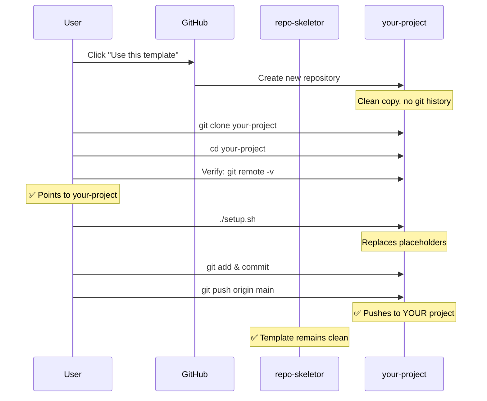

# Proper Template Usage

> The definitive guide to correctly using repo-skeletor as a project template

This guide provides step-by-step instructions for the **correct way** to use the repo-skeletor template to create new projects.

---

## ⚠️ Critical Warning

**This is a TEMPLATE repository. Do not push project-specific changes here.**

If you're seeing this file in a project named `repo-skeletor`, you're probably in the template itself. Follow the instructions below to create your own project from this template.

---

## 🎯 Quick Reference

### ✅ The Correct Way

1. Use GitHub's "Use this template" feature
2. Clone YOUR new repository
3. Verify git remote points to YOUR repository
4. Run `./setup.sh`
5. Start coding in YOUR repository

### ❌ The Wrong Way

1. ~~Clone repo-skeletor directly~~
2. ~~Rename directory locally~~
3. ~~Push changes to repo-skeletor~~

---

## 📋 Step-by-Step Guide

### Step 1: Create a New Repository from Template

#### Option A: Using GitHub UI (Recommended)

1. **Navigate to the template:**
   - Go to [https://github.com/clduab11/repo-skeletor](https://github.com/clduab11/repo-skeletor)

2. **Click "Use this template":**
   - Find the green "Use this template" button
   - Select "Create a new repository"

3. **Configure your new repository:**
   - **Owner:** Your username or organization
   - **Repository name:** Your project name (e.g., `my-awesome-api`)
   - **Description:** Brief description of your project
   - **Visibility:** Public or Private
   - **Do NOT** check "Include all branches"

4. **Click "Create repository"**

✅ **Result:** A clean copy of the template is created in YOUR account, without the template's git history.

#### Option B: Using GitHub CLI

```bash
# Install GitHub CLI if you haven't: https://cli.github.com/

# Create a new repository from the template
gh repo create my-awesome-api \
  --template clduab11/repo-skeletor \
  --public \
  --description "My awesome API project"
```

---

### Step 2: Clone YOUR New Repository

```bash
# Clone YOUR repository (not the template!)
git clone https://github.com/YOUR_USERNAME/YOUR_PROJECT_NAME.git
cd YOUR_PROJECT_NAME
```

**Important:** Replace `YOUR_USERNAME` and `YOUR_PROJECT_NAME` with your actual GitHub username and project name.

---

### Step 3: Verify Git Remote

This is a **critical safety check** to ensure you won't accidentally push to the template.

```bash
# Check your git remote
git remote -v
```

**Expected output:**
```
origin  https://github.com/YOUR_USERNAME/YOUR_PROJECT_NAME.git (fetch)
origin  https://github.com/YOUR_USERNAME/YOUR_PROJECT_NAME.git (push)
```

**🚨 If you see `clduab11/repo-skeletor` in the output:**
```bash
# You're still pointing to the template! Fix it:
git remote set-url origin https://github.com/YOUR_USERNAME/YOUR_PROJECT_NAME.git

# Verify the change
git remote -v
```

---

### Step 4: Run Setup Script

The setup script will customize the template for your project:

```bash
# Make the script executable (if needed)
chmod +x setup.sh

# Run the setup script
./setup.sh
```

**You'll be prompted for:**

| Prompt | Example | Description |
|--------|---------|-------------|
| Project Name | `my-awesome-api` | Your project's name |
| Project Description | `REST API for user management` | Brief description |
| Project Type | `api` | One of: `api`, `web`, `cli`, `lib` |
| Project Domain | `myapp.com` | Your domain (or `example.com`) |
| Notion Spec Database ID | (optional) | Notion database for specs |
| Notion Wiki Page ID | (optional) | Notion wiki page |
| Linear Team ID | (optional) | Your Linear team |

**What the script does:**
- ✅ Replaces `{{PROJECT_NAME}}` with your project name
- ✅ Replaces `{{PROJECT_DESCRIPTION}}` with your description
- ✅ Replaces all other placeholders in config files
- ✅ Creates `.env.example` with required environment variables
- ✅ Updates `.gitignore` with common patterns
- ✅ Initializes git repository (if needed)

---

### Step 5: Configure Environment Variables

```bash
# Copy the example environment file
cp .env.example .env

# Edit .env with your API keys
nano .env  # or vim, code, etc.
```

**Required variables:**
```bash
# AI Assistants
ANTHROPIC_API_KEY=sk-ant-...
GOOGLE_AI_API_KEY=...

# Integrations
LINEAR_API_KEY=lin_api_...
NOTION_API_KEY=secret_...
GITHUB_TOKEN=ghp_...

# Optional but recommended
VOYAGE_API_KEY=...
PERPLEXITY_API_KEY=pplx-...
BRAVE_API_KEY=...
```

**⚠️ Important:** Never commit the `.env` file! It's automatically in `.gitignore`.

---

### Step 6: Configure GitHub Secrets

Add secrets to your GitHub repository for Actions workflows:

1. **Go to your repository on GitHub**
2. **Navigate to:** Settings → Secrets and variables → Actions
3. **Click:** New repository secret

**Add these secrets:**

| Secret Name | Description | Where to Get |
|-------------|-------------|--------------|
| `ANTHROPIC_API_KEY` | Claude API key | [console.anthropic.com](https://console.anthropic.com/) |
| `LINEAR_API_KEY` | Linear API key | Linear Settings → API |
| `NOTION_API_KEY` | Notion integration token | [notion.so/my-integrations](https://www.notion.so/my-integrations) |
| `LINEAR_TEAM_ID` | Your Linear team ID | Linear Settings → Team |
| `NOTION_SPEC_DATABASE_ID` | Notion database for specs | Notion database URL |

**Optional but recommended:**
- `CODECOV_TOKEN` - For code coverage
- `SNYK_TOKEN` - For security scanning
- `SLACK_WEBHOOK_URL` - For notifications

---

### Step 7: Install Dependencies

```bash
# If you're using Node.js/TypeScript
pnpm install  # or npm install, or yarn install

# If you're using Python
pip install -r requirements.txt  # or poetry install

# If you're using other languages, follow their conventions
```

---

### Step 8: Verify Setup

Run basic checks to ensure everything is configured correctly:

```bash
# Check git status
git status

# Verify no placeholders remain
grep -r "{{PROJECT_NAME}}" . --exclude-dir=node_modules --exclude-dir=.git

# Expected: No results (or only in template/ directory)
```

**Test that placeholders were replaced:**

```bash
# Check a config file
cat .claude/settings.json | grep '"name"'

# Should show:
#   "name": "my-awesome-api",
# Should NOT show:
#   "name": "{{PROJECT_NAME}}",
```

---

### Step 9: Make Your First Commit

```bash
# Stage all configured files
git add .

# Commit with conventional commit format
git commit -m "chore: initialize project from repo-skeletor template"

# Push to YOUR repository
git push origin main
```

**🎉 Double-check before pushing:**
```bash
# Verify you're pushing to YOUR repository, not the template
git remote -v | grep "push"
# Should show: YOUR_USERNAME/YOUR_PROJECT_NAME
# Should NOT show: clduab11/repo-skeletor
```

---

### Step 10: Start Developing!

You're all set! Now you can:

- **Create a new branch:**
  ```bash
  git checkout -b your-username/PRX-123-feature-name
  ```

- **Use AI assistants:**
  - Mention `@claude` in PR comments (triggers `claude.yml` workflow)
  - Run `claude` in your terminal for Claude Code subagents + slash commands
  - Run `codex` (Codex CLI) for sandboxed implementation with shared MCP catalog
  - Use GitHub Copilot in your editor for inline completions

- **Create Linear issues:**
  - Issues automatically sync to Notion
  - Branch names follow Linear patterns

- **Set up CI/CD:**
  - Workflows are already configured
  - Push to main triggers deployment

---

## 🔄 Workflow Diagram



---

## 🚫 What NOT to Do

### ❌ Don't Clone the Template Directly

```bash
# This is WRONG:
git clone https://github.com/clduab11/repo-skeletor.git my-project
cd my-project
# You're still connected to the template!
```

**Why it's wrong:**
- Git remote still points to template
- Easy to accidentally push to template
- You inherit the template's git history

### ❌ Don't Fork the Template

```bash
# This is WRONG:
# Clicking "Fork" on GitHub
```

**Why it's wrong:**
- Forks are for contributing back to the original
- Creates a public link to the template
- Not the intended use case

### ❌ Don't Modify template/ Directory

```bash
# This is WRONG:
nano template/README.md  # Don't edit template files!
```

**Why it's wrong:**
- `template/` is a backup reference
- Changes here don't affect your project
- Indicates misunderstanding of structure

---

## 🔧 Troubleshooting

### Issue: Setup script fails

**Solution:**
```bash
# Ensure you have bash
bash --version

# Make script executable
chmod +x setup.sh

# Run with bash explicitly
bash setup.sh

# On Windows, use Git Bash or WSL
```

### Issue: Placeholders not replaced

**Solution:**
```bash
# Run setup again
./setup.sh

# Or manually replace in a file
sed -i 's/{{PROJECT_NAME}}/my-project/g' .claude/settings.json
```

### Issue: Accidentally pushed to template

**Solution:**
1. **Stop immediately** - Don't make more commits
2. **Contact maintainer** - Create an issue on repo-skeletor
3. **Fix your remote:**
   ```bash
   git remote set-url origin https://github.com/YOUR_USERNAME/YOUR_PROJECT.git
   ```
4. **Cherry-pick your changes** to the correct repository

### Issue: GitHub Actions not running

**Solution:**
1. **Check repository settings:**
   - Settings → Actions → General
   - Ensure "Allow all actions" is selected
2. **Check secrets:**
   - Settings → Secrets and variables → Actions
   - Verify required secrets are added
3. **Check workflow file:**
   ```bash
   ls -la .github/workflows/
   ```

---

## 🎓 Understanding Template Concepts

### What is a Template Repository?

A template repository is a **blueprint** that allows you to create new repositories with the same directory structure and files, but **without the git history**.

**Think of it like:**
- 📋 A form with blank fields to fill in
- 🍪 A cookie cutter for making cookies
- 🏗️ A blueprint for building houses

### Template vs. Fork vs. Clone

| Method | Use Case | Git History | Remote |
|--------|----------|-------------|--------|
| **Use Template** ✅ | Create new project | No history | Your repo |
| Fork | Contribute to original | Full history | Template + your repo |
| Clone | Make local copy | Full history | Template |

**For creating new projects, always use "Use this template"!**

---

## 📚 Next Steps

After setting up your project:

1. **Read the documentation:**
   - [Template Structure](./Template-Structure.md)
   - [GitHub Actions Architecture](./GitHub-Actions-Architecture.md)
   - [Customization Guide](./Customization-Guide.md)

2. **Configure integrations:**
   - [Linear ↔ Notion Sync](./Linear-Notion-Sync.md)
   - [Secrets & Environment Setup](./Secrets-and-Environment-Setup.md)

3. **Learn from mistakes:**
   - [Common Mistakes](./Common-Mistakes.md) - Avoid pitfalls

4. **Start coding:**
   - Create your first feature branch
   - Write your first component
   - Push your first PR

---

## 🤝 Contributing to the Template

If you want to **improve the template itself** (not your project):

1. **Fork** the template repository
2. **Make improvements** to template files
3. **Submit a pull request** to `clduab11/repo-skeletor`

See [CONTRIBUTING.md](../../CONTRIBUTING.md) for details.

---

## ❓ FAQ

**Q: Can I update my project when the template changes?**

A: Not automatically. You can manually copy new features or improvements from the template to your project.

**Q: Should I keep the template/ directory in my project?**

A: Yes, it serves as a reference for the original template structure.

**Q: Can I use this template for private repositories?**

A: Yes! When creating from template, choose "Private" visibility.

**Q: What if I need to customize heavily?**

A: That's fine! The template is a starting point. Customize as needed for your project.

**Q: Can I create multiple projects from the same template?**

A: Absolutely! That's the whole point. Use "Use this template" for each new project.

---

**🎉 You're ready to use repo-skeletor correctly! Happy coding!**

---

**See Also:**
- [Common Mistakes](./Common-Mistakes.md) - Learn what NOT to do
- [Quick Start Guide](./Quick-Start-Guide.md) - Fast track setup
- [Template Structure](./Template-Structure.md) - Understand the layout
